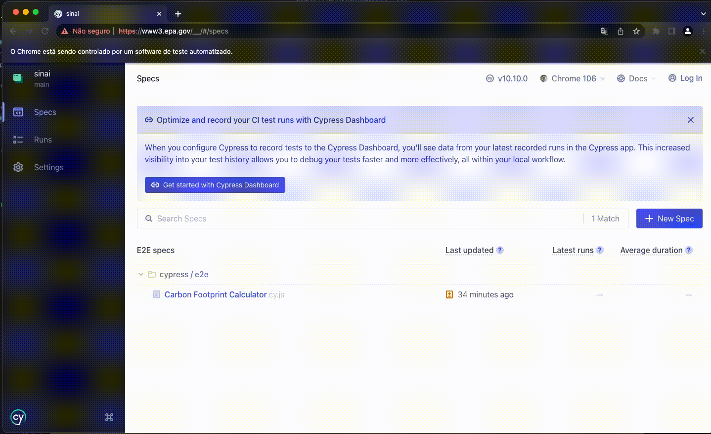

# Carbon Footprint Calculator
End to End Automated tests with Cypress

## Getting the Project
 - First: you need [NodeJS](https://nodejs.org/en/) installed to run Cypress aplications
 - Clone the Repository https://github.com/alttabs/Carbon-Footprint.git 
 - In the folder application `npm install` to install the dependencies
 - Now, to run the application `npx cypress open`

## Running Tests
After running the application will open a localhost window then you will be able to monitor the test execution in real-time

## Test Data
The test data was based on US residents from [Move.org](https://www.move.org/utility-bills-101/) with an attempt to get close to the real-world data that way the calculator report will show the CO2 estimate emission by year and how to decrease the emission. 

## Project Architecture 
> Why Using Page-Oriented-Model

The aim of using this model is to it reduces code duplication and improve test maintenance, that way testers can reuse functions, and change selectors without the need for too much effort or get a broken code

- Folders: 
    - `e2e`: end-to-end scenarios location
    - `support`: Files that will support the scenarios that it separated by Pages
        - `elements`: contain the Page elements selectors
        - `index`: manipulation of Page elements

---
Made with 🌟 by [Thabata Almeida](https://www.linkedin.com/in/thabataalmeida/) 